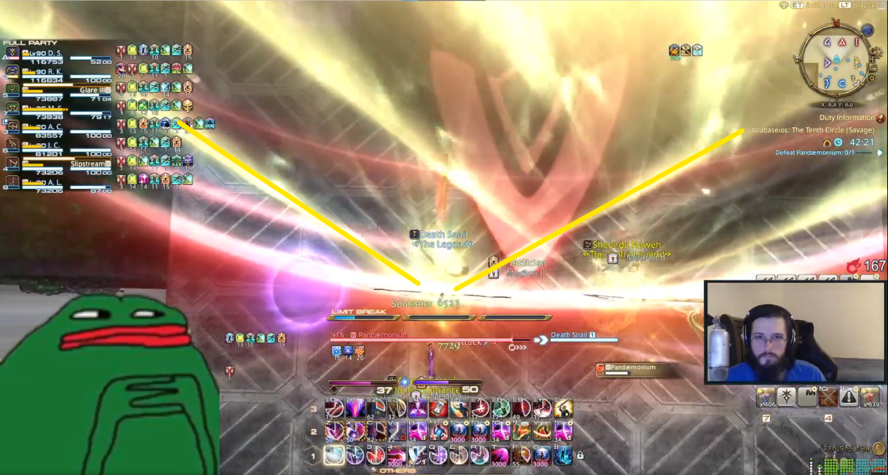

# The Tenth Circle
###Marker Setup

Exact colors and number don't matter

###Timeline
[Fight Timeline can be found here](https://ff14.toolboxgaming.space/timeline?id=75393810445861). They cleared at exactly 10 minutes in the vod, so I don't know what comes after.

###Major Mechanics:
#####_Dividing Wings / Steel Web:_
**Setup:**
Two winged spears will spawn in the center of the arena. After a few seconds, they will tether to two random players. Once these tethers disappear, each tethered player will fire a lethal 120 degree cone across the map.

Just after the spears come down, a random dps and a random tank/healer will recieve a stack marker. Everyone who takes this stack will be tethered together by webbing. This webbing immobilizes and, a few seconds later, instantly kills anyone who has not been freed. If more than three people are tethered together, the webbing solidifies and cannot be broken, guaranteeing death.

The boss will follow this up with a cast of either Pandaemon's Holy or Circles of Pandaemonium.

**Resolution:**
_Tether players:_
Have the two players tethered by the spears stand just in front of them, standing between the boss and the spears. You can see the exact spot in the image below. 
Once the tether is resolved, these players should run backward through all of the webbing binding their teammates, freeing them.
Click [here](https://clips.twitch.tv/SlipperySavoryBadgerBabyRage-AD_M6HT4I_bEkNDD) for tether player clip.

_Webbed Players:_
Designate a player who will float for each light party. They will be responsible for filling in case a single light party gets both stack markers.
Have the marked players stand in the middle left and right of the room while their stack buddies form a triangle around them. This ensures that the webbing between players is long enough to be broken.
Click [here](https://clips.twitch.tv/CrypticFrigidZebraWow--m2U0MVGTdyTFzzK) for stack players clip.

Click [here](https://clips.twitch.tv/KindBetterSquirrelCharlietheUnicorn-ggJUCv-ej8ZF0nL4) for failure state in case too many people get webbed.

####

# The Eleventh Circle
###Marker Setup
# The Twelfth Circle
###Marker Setup