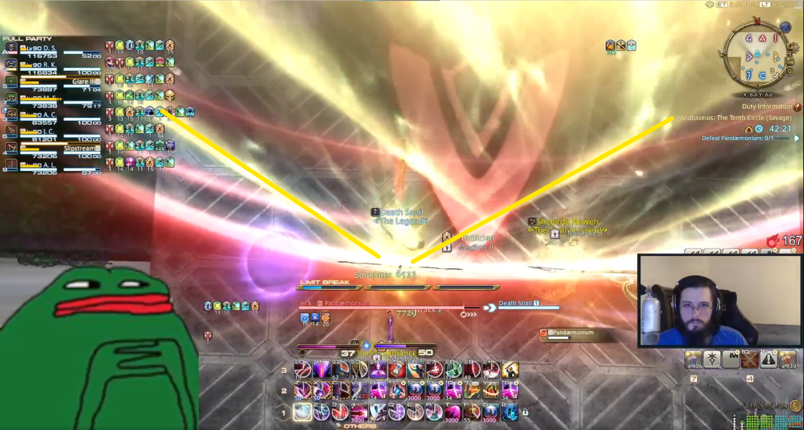
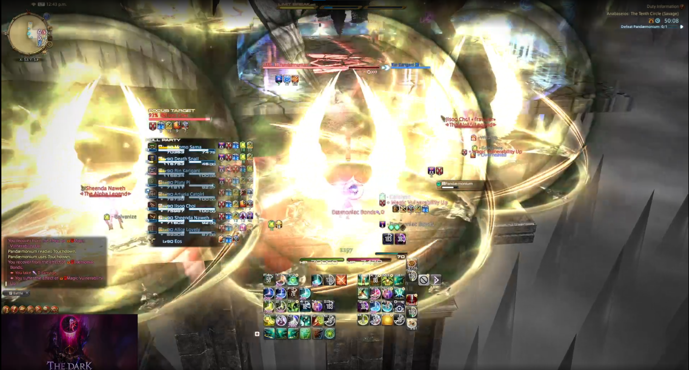

# The Tenth Circle
Vod of the clear [here](https://www.twitch.tv/videos/1833080083?t=6h43m45s)
## Marker Setup

Exact colors and numbers don't matter

## Timeline
[Fight Timeline can be found here](https://ff14.toolboxgaming.space/timeline?id=75393810445861). They cleared at exactly 10 minutes in the vod, so I don't know what comes after.

## Major Mechanics:
### _Dividing Wings / Steel Web:_
**Setup:**
Two winged spears will spawn in the center of the arena. After a few seconds, they will tether to two random players. Once these tethers disappear, each tethered player will fire a lethal 120 degree cone across the map.

Just after the spears come down, a random dps and a random tank/healer will recieve a stack marker. Everyone who takes this stack will be tethered together by webbing. This webbing immobilizes and, a few seconds later, instantly kills anyone who has not been freed. If more than three people are tethered together, the webbing solidifies and cannot be broken, guaranteeing death.

The boss will follow this up with a cast of either Pandaemon's Holy or Circles of Pandaemonium.
Pandaemon's Holy => Middle row is safe
Circles of Pandaemonium => First row is safe

**Resolution:**
_Tether players:_
Have the two players tethered by the spears stand just in front of them, standing between the boss and the spears. You can see the exact spot in the image below. 
Once the tether is resolved, these players should run backward through all of the webbing binding their teammates, freeing them.
[Clip](https://clips.twitch.tv/SlipperySavoryBadgerBabyRage-AD_M6HT4I_bEkNDD) for tether player PoV.

_Webbed Players:_
Designate a player who will float for each light party. They will be responsible for filling in case a single light party gets both stack markers.
Have the marked players stand in the middle left and right of the room while their stack buddies form a line on either side of them. This ensures that the webbing between players is long enough to be broken. Triangles will work too (as seen in the clip) but require more movement.
[Clip](https://clips.twitch.tv/CrypticFrigidZebraWow--m2U0MVGTdyTFzzK) for stack players PoV.

[Clip](https://clips.twitch.tv/KindBetterSquirrelCharlietheUnicorn-ggJUCv-ej8ZF0nL4) for failure state in case too many people get webbed.

### _Wicked Step / Entangling Web:_
**Setup:**
Two tankbuster towers will spawn on the left and right. After the tower explodes, anyone standing in it will be thrown very far away.

Afterwards, both tanks and two random players will be targeted with webbing AOEs. After they go off, they leave behind webbing briefly on the ground. If in close proximity to other ground webs, they will form a path between themselves.

**Resolution:**
Both tanks need to be knocked to sides _opposite_ their light party, otherwise they'll be thrown too far and miss the platforms. Safe spot is below. Mirrored on the other side for the other tank. 

Each tank will need on partner so they can combine the webs together to make a path out to the side platforms. Have the remaining 6 players on the platform line up in a conga line to decide who goes to which tank.

[Clip](https://clips.twitch.tv/ConfidentTemperedJuice4Head-qsbMl7jcf5iIuk2h) of resolution.

### _Pandaemoniac Pillars:_
**Setup:**
Towers will spawn in set locations across the arena. Afterward, the towers will animate and choose to either perform a donut or circle AOE under them as seen below. At the same time, the boss will cast either Pandaemon's Holy or Circles of Pandaemonium.

**Resolution:**
Have each player stand on their assigned tower. Afterward, hover between the first and second rows of the arena. Once the boss begins his cast of Holy or Circles, move to the first or second row and identify the single tower that has purple beams coming from it (as seen above). That is the safe spot.

### _Silkspit + Pandaemoniac Meltdown + Daemonic Bonds:_
**Setup:**
Each player will receive an AOE marker under them.

Afterwards, the boss will case Daemonic Bonds, putting either one or two of three possible purple debuffs on each players. The debuffs are

- Solo stack. Will always happen (denoted by a single character icon on the debuff)
- Duo stack. Will always target all T/H or DPS (two character icons)
- Light party stack. Will always target one t/h and one dps (four character icons)

Once these debuffs reach zero, a medium size AOE occur around the player, killing them if they do not satisfy the requirements of the debuff. Size of the AOE is below.

Then the boss will cast Touchdown, causing the middle arena to become a lethal AOE. This mechanic ends with another raidwide cast.

**Resolution:**
Have melees and tanks go left and right onto the far platforms depending on their light party, healers in the middle main platform, casters in the back.

All players should immediately come back to the middle for healing and to form a conga line to determine who should go left or right to fire their solo beam. Take this time to determine which players should go to which outer platforms for Touchdown. They should spread or stack according to which debuff expires first.

The logic is straightforward:
- If four stack debuffs go out, DPS all go left, T/H go right.
- Otherwise light parties go left and right.

[Clip](https://clips.twitch.tv/UnsightlySmellyCiderTwitchRPG-Aw7cGJG1yMmOQMb9) of duo stack.

[Clip](https://clips.twitch.tv/AlluringTangentialTomatoCoolCat-K-uzuh-qpcEL1Mtt) of four stack.

### _Daemoniac Bonds + Pandaemonic Turrets:_
**Setup:**
The boss will cast Daemoniac Bonds. The same rules as before apply here, but they will resolve _after_ the turret phase is over.

Eight towers will spawn; 4 at the front of the arena, 4 at the back. After being soaked, turrets will spawn in their place with two sets of four limit cut markers over their heads. This determines the order in which they will fire. They will automatically turn towards the closest player and fire a beam across the entire arena while also dealing significant knockback to each player hit. 
Each beam will apply a single darkness down debuff to the player closest to the beam. These players cannot be hit again or they will suffer lethal damage.

**Resolution:**
Split into light parties and take each beam as a group. Once one person receives a debuff, they must avoid every other beam for the rest of this mechanic.

Have each player pre-position themselves in each square on the first and third rows of the arena to soak the towers. Afterward, each player should run forward towards the middle of the arena so they can quickly adjust to which turret they need to tank. Turrets will always spawn a single number set on one side of the arena (the two turrets with the 1 marker will always both be north or south, for example). Example below.

In order to determine which light party should go to which number 1 marker like in the picture above, use the left/right light parties from prior mechanics to decide which group takes the "rightmost" and the "leftmost" turrets. So if the 1 marked turrets spawned on columns 1 and 2, the left light party would soak the furthest left turret, the right light party would soak the rightmost.

Once all beams have been tanked, each player has ~4 seconds to resolve the first set of daemonic bonds, so be ready.

[Clip](https://clips.twitch.tv/PlayfulBoringCobraRaccAttack-fVMR9CWnm41ApgBV) of resolution.

### _Pandaemoniac Ray:_
**Setup:**
A red light will glow on either side of the boss's head, indicating that that half of the arena is about to become unsafe. Once the AOE goes off, eight golden orbs will spawn in its wake, firing small line AOEs horizontally across the arena.

**Resolution:**
The party should stand on the not-dangerous side. To dodge the small orbs, stand in the safe spots between their AOEs. Note that these AOEs are offset, so it is difficult to determine a safe spot ahead of time based on the floor layout.

[Clip](https://clips.twitch.tv/GeniusBlitheSushiRlyTho-ltl1GfMWjUxGH-pU) of resolution.

### _Dividing Wings + Entangling Web x2 + Stacks:_
**Setup:**
Three web AOEs will apear on three players and another pair of spears will come down tethering to two more. At the same time, another player will get a stack marker on them, webbing together everyone who soaks it.
As soon as the stack marker goes off, the three players who did not receive tethers or the first set of web AOEs will get their own web AOEs.

**Resolution:**
Have players form a conga line to determine where they should go for placing their web AOEs at the south of the arena. The two tether players point their tether east/west and slightly north to avoid cleaving the party. 
All remaining players should stack in the center to take the soak. The two tethered players need to _quickly_ run through the webbing to free the stack players so they can take their AOEs south in the same spots as the prior AOE group.

Putting the AOEs at the very south for each set is important for the next mechanic. 

[Clip](https://clips.twitch.tv/FastAffluentSowNerfBlueBlaster-VsHcaXpHNVr3CvUM)

### _Harrowing Hell + Daemoniac Bonds:_
**Setup:**
The boss casts Daemoniac Bonds then begins hammering its head against the arena, dealing medium raid damage. This repeats eight times. Afterward he will apply a major knockback to all players to the back of the room. Moments later, the daemonic bonds will resolve.

**Resolution:**
Stacking the webs together in the prior mechanic is required in order to build a "web wall" that prevents players from being knocked off the platform when the knockback occurs.

Mitigation requirements are very high. Plan accordingly. Tank LB3 is used around headslam 4 or 5. It's important for the party to pre-position before the knockback for the first set of Daemoniac Bonds debuff, then quickly spread/stack for the second set.

[Clip](https://clips.twitch.tv/PeacefulSolidMochaTBTacoRight-RGQrR7kfAAgp1VDu)

### _Parted Plumes:_
**Setup:**
A spear will land in the middle of the main arena and quickly causes a large circular area around it to become lethal. It will then slowly put pie slice AOEs on the ground eventually covering the entire arena.

While the pie slice AOEs are forming, the boss will choose one half of the arena to nuke with Pandaemoniac Ray. He will then follow up with a very fast Holy/Circle (dynamo/chariot).

**Resolution:**
The party should stand on the last pie slice AOE, then run into the next slice after it has exploded. Players should stay as close to the center as possible while doing so in order to dodge the Pandaemoniac Ray, which resolves _after_ the last set of pie slices go off. There is plenty of time.
Aftwards, the golden orb beams will reappear. Try to dodge them close to the boss's hitbox in order to give ample time to make it to row 2 or 3 for the Holy/Circle afterward.

## _Various Other Mechanics:_
All other mechanic sequences not mentioned are remixes of the above. You can watch a vod of the clear [here](https://www.twitch.tv/videos/1833080083?t=6h43m45s).

Some tricky combinations to mention:
#### _Dividing Wings + Touchdown_:
Have DPS go left, T/H go right when resolving the web stack. The tethered players need to point the cone away from the boss. They can almost stand on the spear. [Clip](https://clips.twitch.tv/StrongBloodyOstrichSaltBae-Qm2B53ybMNscNE8s)